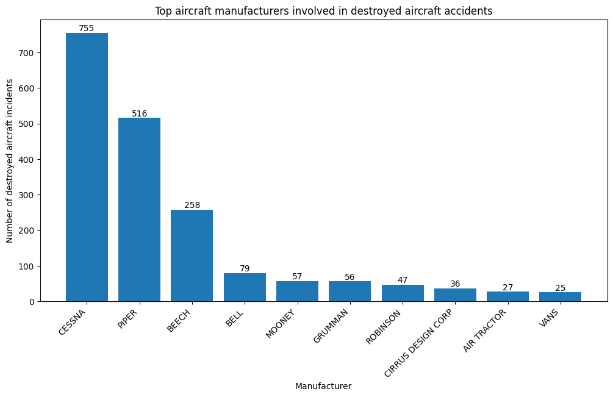
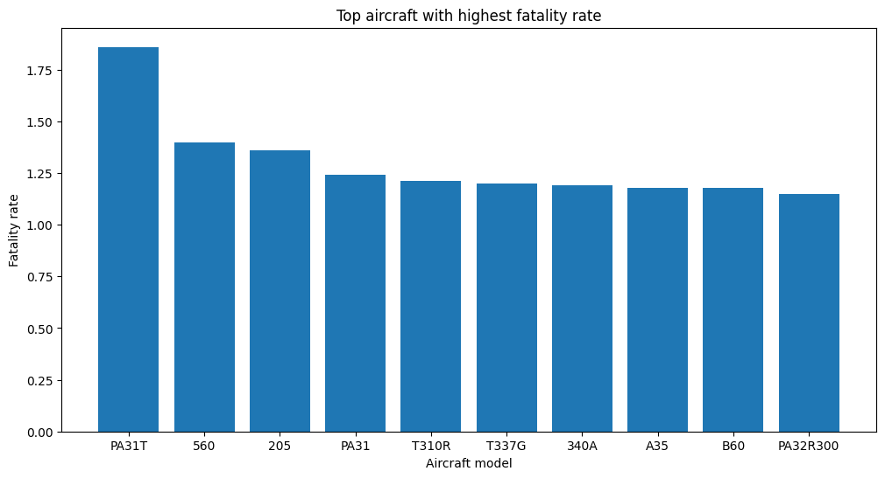
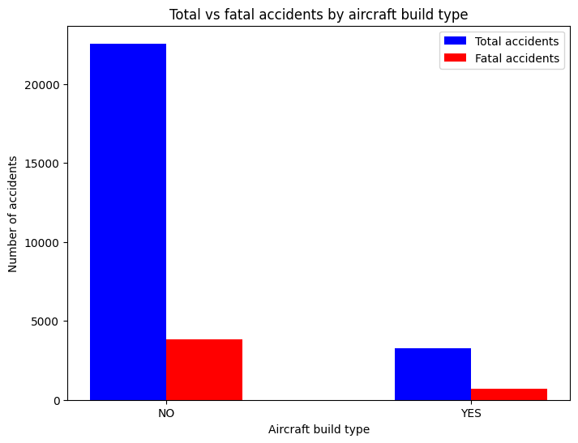

# Aircraft risk analysis

# Overview
This project aims to analyze historical aviation data from the National Transportation Safety Board (NTSB) spanning from 1962 to 2023. The dataset gathers near 88 889 records on aviation event. The project caters to a primary audience, the business stakeholders who need intuitve summaries and clear recommendations. The ultimate goal is to translate the findings into clear and actionable insights that support safer operational strategies.

# Business understanding
## Business problem

A company is expanding into new industries to diversify its portfolio and has identified aviation as a promising area for investment. The company plans to purchase and operate airplanes for both commercial and private use. However, it currently lacks expertise in aviation safety and wants to understand the potential risks associated with different types of aircraft before making any purchases.

## Stakeholders
The primary stakeholder is the head of the new aviation division, who will be responsible for aircraft acquisition and operations. This individual needs data-driven insights to make informed decisions that prioritize safety and cost-efficiency, but also long-term operational reliability.

## Key business questions
1. Which aircraft manufacturers or models have the highest historical accident rates or major damages?
2. Which aircraft types (factory-built vs. amateur-built) are associated with lower risk profiles?
3. Which aircraft type/category should be prioritized for purchase based on safety metrics such as fatality rate?

# Data understanding and analysis
## Source of data
The dataset from the NTSB includes detailed records for events, dating back to 1962, with unique identifiers for every aviation occurence. This historical data source provides valuable insight into aviation safety trends overtime.

## Description of data
Each record represents an individual aviation incident or accident and includes key details such as:
- Aircraft manufacturer and model
- Date and location of the event
- Injury severity, including number of fatalities and injuries
- Damage level sustained by the aircraft
- Weather conditions at the time of the event
- Flight phase (takeoff, landing, cruise)
- Purpose of flight (instructional, personal, business)

## Visualizations
1. Manufacturers with highest number of accidents count

Some manufacturers has a disproportionately high number of destroyed aircraft in accidents. Planes from those manufacturers may cost more to insure and repair which could affect long-term operational costs.

2. Models with the highest fatality rate

Model like the Piper PA-31T has higher fatality rates compared to others with similar accident counts. Even if a model has fewer accidents, a high fatality rate suggests increased risk.

1. Type of built with safest track records

Amateur-built aircraft has a higher fatality rate despite being involved in fewer overall accidents. Unless there’s a compelling reason to buy amateur-built aircraft, factory-built planes appear safer and more predictable in terms of risk.

# Conclusion
Based on the analysis conducted, here are three key recommendations to help the company make informed decisions when purchasing and operating aircraft:
1. Prioritize factory-built aircraft over amateur-built models
    * Unless there is a specific operational or cost-related reason to consider amateur-built aircraft, the company should prioritize purchasing factory-built models, which generally offer better safety records, more predictable maintenance and repair processes, and easier access to manufacturer support and spare parts.
2. Avoid high-risk aircraft models with elevated fatality rates
    * Avoid purchasing or limit exposure to these high-risk models. Instead, opt for models with lower historical fatality rates and higher survival rates in accidents. You may also consider focusing on more modern models with updated safety features and better-engineered crash survivability.
3. Favor aircraft with lower accidents count
    * Focus on acquiring aircraft category that have lower accidents count but also lower fatality rate. Additionally, you could analyze maintenance history and engine type to further refine risk assessment.

# Further discussions
If further analysis had been conducted, there would have been additional discussions that could provide deeper insights into aircraft risk and safety trends.
1. Identify aircraft models with high recurrence of mechanical failures
    * Some aircraft models may have recurring mechanical issues that increase risk over time. Identifying these can help avoid purchasing or operating planes prone to system failures.
2.  Understand how weather conditions influence accident severity 
    * Weather plays a major role in aviation safety. Analyzing how different weather conditions affect accident outcomes helps assess operational risk under various flying environments.
3. Predict likelihood of fatalities based on phase of flight
    * Accidents during specific phases such as takeoff or landing may carry higher fatality risks. This analysis could reveal opportunities for targeted training or protocol improvements.