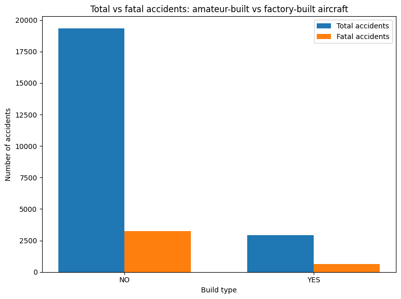
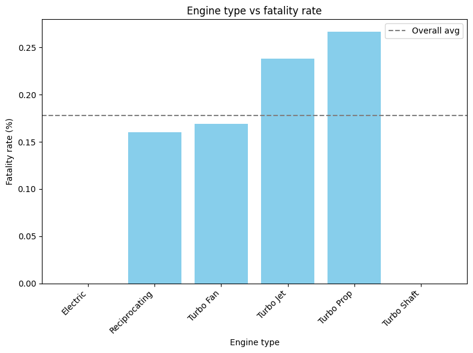
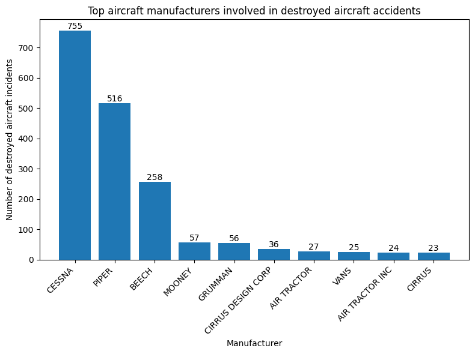

# Aircraft risk analysis

# Overview
This project aims to analyze historical aviation data from the National Transportation Safety Board (NTSB) spanning from 1962 to 2022. The dataset gathers near 88 889 records on aviation event. The project caters to a primary audience, the business stakeholders who need intuitve summaries and clear recommendations. The ultimate goal is to translate the findings into clear and actionable insights that support safer operational strategies.

# Business understanding
## Business problem

A company is expanding into new industries to diversify its portfolio and has identified aviation as a promising area for investment. The company plans to purchase and operate airplanes for both commercial and private use. However, it currently lacks expertise in aviation safety and wants to understand the potential risks associated with different types of aircraft before making any purchases.

## Stakeholders
The primary stakeholder is the head of the new aviation division, who will be responsible for aircraft acquisition and operations. This individual needs data-driven insights to make informed decisions that prioritize safety and cost-efficiency, but also long-term operational reliability.

## Key business questions
1. Which types of aircraft and manufacturers should we prioritize to minimize risk?
2. Are there specific aircraft models or manufacturers we should avoid due to safety concerns?
3. Should we consider engine type as a key factor when selecting aircraft models for purchase?

# Data understanding and analysis
## Source of data
The dataset from the NTSB includes detailed records for events, dating back to 1962, with unique identifiers for every aviation occurence. This historical data source provides valuable insight into aviation safety trends overtime.

## Description of data
Each record represents an individual aviation incident or accident and includes key details such as:
- Aircraft manufacturer and model
- Date and location of the event
- Injury severity, including number of fatalities and injuries
- Damage level sustained by the aircraft
- Weather conditions at the time of the event
- Flight phase (takeoff, landing, cruise)
- Purpose of flight (instructional, personal, business)

According to the given business problem, the company is specifically interested in purchasing airplanes , not other aircraft types (e.g., helicopters, gliders). Including non-airplane data would mislead our analysis, as these aircraft have different operational risks, regulations, and use cases. To ensure that our findings reflect risks and avoid biases from non-catastrophic events, we will filter our data to focus on accidents.

## Visualizations
### Basic visualizations
1. Total vs fatal accidents: amateur-built vs factory-built aircraft

Amateur-built aircraft have a higher fatality rate despite fewer total accidents, indicating that when accidents occur, they are more likely to be fatal. Factory-built aircraft, while involved in more incidents overall, have a lower proportion of fatal outcomes, suggesting a safer profile. This disparity highlights that build type significantly influences both the frequency and severity of accidents.

1. Engine type vs fatality rate

Electric engines have the lowest fatality rate, making them the safest option, while Turbo Prop and Turbo Jet engines show significantly higher risks. Reciprocating and Turbo Fan engines fall in the middle with moderate fatality rates. This variation suggests that engine type plays a key role in determining risk levels. Operations using Turbo Prop or Turbo Jet engines may require stricter safety protocols and advanced pilot training. Electric and Reciprocating engines, while comparatively safer, still require standard safety measures.

1. Top aircraft manufacturers involved in destroyed aircraft accidents

The chart highlights a significant disparity in the number of destroyed aircraft incidents across different manufacturers. CESSNA and PIPER stand out with the highest numbers, suggesting they may carry a higher risk profile. However, further analysis is needed to contextualize these findings.

### PowerBI interactive dashboard
File is in the Dashboard folder.

# Conclusion
Based on the analysis conducted, here are three key recommendations to help the company make informed decisions when purchasing and operating aircraft:
1. Prioritize factory-built aircraft from low-risk manufacturers
    - Amateur-built aircraft and certain manufacturers show higher rates of destroyed incidents and fatal outcomes. Focus on purchasing factory-built aircraft from manufacturers with historically lower damage and fatality rates, such as CESSNA, AIR TRACTOR INC, or MAULE. These aircraft tend to have better design oversight, standardized maintenance protocols, and a larger support infrastructure, reducing operational risk.
2. Select aircraft with turbo fan or electric engines; avoid turbo prop for high-risk missions
    - Turbo Prop engines have the highest fatality rate among all engine types. Consider Turbo Fan or Electric engines for safer performance profiles, especially for commercial use. Electric engines offer the lowest fatality rates and may represent a future-forward investment, particularly for short-range or training missions.
3. Avoid high-risk aircraft models with poor safety histories
    - Based on incident data, some aircraft models and manufacturers show disproportionately high rates of destroyed aircraft incidents and fatal outcomes. Specifically, aircraft from GRUMMAN, and certain models under BEECH, PIPER, or MOONEY have shown higher-than-average risks in terms of both damage severity and injury outcomes. Investigate model-specific safety records before purchase, not all models within a manufacturer carry the same risk profile.

# Further discussions
If further analysis had been conducted, there would have been additional discussions that could provide deeper insights into aircraft risk and safety trends.
1. Deep dive into high-risk aircraft models
    - Focusing on high-risk aircraft models can reveal which specific models have higher destruction or fatality rates, helping identify risks linked to design flaws or operational misuse. This analysis helps the company to make informed purchasing decisions by model, avoiding those with poor safety histories even within generally reliable manufacturer brands.
2. Cause analysis of accidents by build type
    - Investigating the root causes of accidents across factory-built vs amateur-built aircraft can reveal why amateur-built aircraft show higher fatality and destruction rates. This analysis would help determine whether risks stem from design flaws, lack of oversight, insufficient pilot experience, or specific mechanical failures more common in amateur-built models. 
3. Mapping of Flight Purpose to Risk Profile and Aircraft Type
    - Cross-referencing flight purpose with aircraft make/model, engine type, accident severity can reveal which aircraft types are historically safer or riskier for specific missions. This analysis helps identify whether certain models or engine types are more prone to accidents depending on how the aircraft is used.